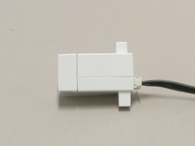

# カラーセンサー（ロボット拡張ユニット接続パーツ）の制御



<br>
<small>(※)本カラーセンサーを使用する場合、ロボット拡張ユニットが必要になります。<br></small>

カラーセンサーはポート番号I2Cに接続してください。</br>
カラーセンサーの検出可能距離は約20mmです。</br>
カラーセンサーの制御はArtecRobo.ColorSensorクラスに定義されています。</br>
はじめに、下記のようにArtecRoboクラスをインスタンス化します。
ColorSensorクラスのインスタンス作成時は、ArtecRoboクラスのインスタンスを引数に指定する必要があります。
```Javascript
// Javascript Example
var atcRobo = new Artec.ArtecRobo("YOUR_STUDUIOBIT_ID");
atcRobo.onconnect = async function () {
     let sensor = new Artec.ArtecRobo.ColorSensor(atcRobo);　//カラーセンサーを接続する場合
}
```

## getValuesWait();
カラーセンサーの値を返します。計測物体の色情報を取得し、赤成分、緑成分、青成分、輝度を配列で返します。

```Javascript
// Javascript Example
while(1){
     const color = await sensor.getValuesWait();
     console.log("R:%f G:%f B:%f L:%f",color[0],color[1],color[2],color[3]); //カラーセンサーの値をConsoleに表示します
     await atcRobo.studuinoBit.wait(1000);
}
```
上のサンプルコードはカラーセンサーの値を1秒ごとに表示します。
* 詳細<br>
https://artec-kk.github.io/obniz-artecrobo2/docs/classes/artecrobocolorsensor.html#getvalueswait


## getColorCodeWait();
計測物体の色を数字で返します。

| 数字  |  色  |
|:----:|:----:|
|  0   |判定不可|
|  1   |　赤　　|
|  2   |　緑　　|
|  3   |　青　　|
|  4   |　白　　|
|  5   |　黄　　|
|  6   |　橙　　|
|  7   |　紫　　|

```Javascript
// Javascript Example
while(1){
     const color = await sensor.getColorCodeWait();
     if(color==0){
         console.log("Undefine");
     }else if(color==1){
         console.log("Red");
     }else if(color==2){
         console.log("Green");
     }else if(color==3){
         console.log("Blue");
     }else if(color==4){
         console.log("White");
     }else if(color==5){
         console.log("Yellow");
     }else if(color==6){
         console.log("Orange");
     }else if(color==7){
         console.log("Purple");
     }
     await atcRobo.studuinoBit.wait(1000);
}
```
上のサンプルコードでは物体の色を1秒ごとに表示します。

* 詳細<br>
https://artec-kk.github.io/obniz-artecrobo2/docs/classes/artecrobocolorsensor.html#getcolorcodewait

## カラーセンサーのサンプルプログラム
カラーセンサーで取得した色によって、LEDの色が変わるプログラムです。
```Javascript
// Javascript Example
<html>
<head>
  <meta charset="utf-8">
  <script src="https://obniz.io/js/jquery-3.2.1.min.js"></script>
  <script src="https://unpkg.com/obniz@3.0.0/obniz.js"></script>
  <script src="https://artec-kk.github.io/obniz-artecrobo2/artec.js"></script>
</head>
<body>

<div id="obniz-debug"></div>
<h1>obniz instant HTML</h1>
<br/><br/>


<script>
  var atcRobo = new Artec.ArtecRobo("YOUR_STUDUIOBIT_ID");

  atcRobo.onconnect = async function () {
    let sensor = new Artec.ArtecRobo.ColorSensor(atcRobo);

    //wifi接続／動作確認用
    atcRobo.studuinoBit.led.on();
    
    //指定した色で全点灯
    function oneColor(color) {
        atcRobo.studuinoBit.display.off();
        for (let x = 0; x < 5; x++) {
          for (let y = 0; y < 5; y++) {
              atcRobo.studuinoBit.display.setPixel(x,y,color);
          }
        }
        atcRobo.studuinoBit.display.on();
     }

    while(1){
        const color = await sensor.getColorCodeWait();     //カラーセンサーによって色を取得します
         if(color==0){
             console.log("Undefine");
             atcRobo.studuinoBit.display.off();    //displayを消灯します
         }else if(color==1){
             console.log("Red");
             oneColor("RED");    //赤色に点灯します
         }else if(color==2){
             console.log("Green");
             oneColor("GREEN");    //緑色に点灯します
         }else if(color==3){
             console.log("Blue");
             oneColor("BLUE");    //青色に点灯します
         }else if(color==4){
             console.log("White");
             oneColor("WHITE");    //白色に点灯します
         }else if(color==5){
             console.log("Yellow");
             oneColor("YELLOW");    //黄色に点灯します
         }else if(color==6){
             console.log("Orange");
             oneColor("ORANGE");    //橙色に点灯します
         }else if(color==7){
             console.log("Purple");
             oneColor("PURPLE");    //紫色に点灯します
         }
        await atcRobo.studuinoBit.wait(1000);
    }
  };

</script>
</body>
</html>
```

