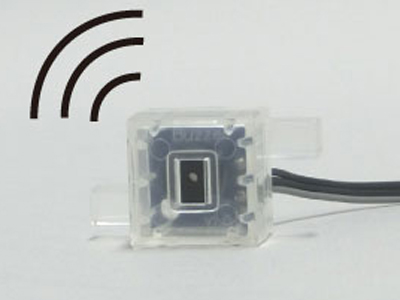

# ブザー（ロボット拡張ユニット接続パーツ）の制御

<br>
<small>(※)本ブザーを使用する場合、ロボット拡張ユニットが必要になります。ロボット拡張ユニットとブザーの接続は、[ArtecRobo2.0取扱説明書](https://www.artec-kk.co.jp/artecrobo2/pdf/jp/82541man_K0419_J.pdf)の「6 ロボット拡張ユニット各部の機能と名称」を参照してください。<br></small>


ブザーの制御はArtecRobo.Buzzerクラスに定義されています。</br>
はじめに、下記のようにArtecRoboクラスをインスタンス化し、接続パーツのポート番号（P13/P14/P15/P16）を指定することで、ブザーを使用できます。
```Javascript
// Javascript Example
var atcRobo = new Artec.ArtecRobo("YOUR_STUDUIOBIT_ID");
atcRobo.onconnect = async function () {
    let buzzer = new Artec.ArtecRobo.Buzzer(atcRobo, 'P13');　//P13にブザーを接続する場合
}
```


## onWait( String : frequency |String: scale, Number: duration);

ブザーから指定された音を出します。</br>
音は周波数（数字）もしくは音階（アルファベットと数字の組み合わせ）で記述します。</br>
音階はC3（130Hz）～C8（4186Hz）に対応しています。</br>

```Javascript
// Javascript Example
await buzzer.onWait("450");
```
 上のサンプルコードでは450Hzの音がブザーから鳴ります。


```Javascript
// Javascript Example
await buzzer.onWait("A4");
```
A4（ラ）の音がブザーから鳴ります。</br>
</br>
音の長さを数字で指定することも可能です。（単位:ms）
```Javascript
// Javascript Example
await buzzer.onWait("C4", 1000);
```
上のサンプルコードではC4の音が1秒鳴ります。</br>
* 詳細<br>
https://artec-kk.github.io/obniz-artecrobo2/docs/classes/artecrobobuzzer.html#onwait


## off();

ブザーを止めます。

```Javascript
// Javascript Example
buzzer.off();
```
* 詳細<br>
https://artec-kk.github.io/obniz-artecrobo2/docs/classes/artecrobobuzzer.html#off


## ブザーのサンプルプログラム
Aボタンを押すと指定した音（周波数）でブザーが鳴り、Bボタンを押すとブザーが止まります。

```Javascript
// Javascript Example
<html>
<head>
  <meta charset="utf-8">
  <meta name="viewport" content="width=device-width, initial-scale=1">
  <script src="https://obniz.io/js/jquery-3.2.1.min.js"></script>
  <script src="https://unpkg.com/obniz@2.2.0/obniz.js"></script>
  <script src="https://artec-kk.github.io/obniz-artecrobo2/artec.js"></script>
</head>
<body>

<div id="obniz-debug"></div>
<h1>obniz instant HTML</h1>
<br/><br/>

<input type="number" value="440" id="hz"/>Hzの音を出す

<script>
  var atcRobo = new Artec.ArtecRobo("YOUR_STUDUIOBIT_ID");
  atcRobo.onconnect = async function () {
    let buzzer = new Artec.ArtecRobo.Buzzer(atcRobo, 'P13');
    
    //wifi接続／動作確認用
    atcRobo.studuinoBit.led.on();
    
    while(1){
        let pressedA = atcRobo.studuinoBit.button_a.wasPressed();　//Aボタンが押されたときtrueを返します
        let pressedB = atcRobo.studuinoBit.button_b.wasPressed();　//Bボタンが押されたときtrueを返します
        await atcRobo.studuinoBit.wait(100);
        let hz = parseInt($("#hz").val());
        if(pressedA==true){
          await buzzer.onWait(hz);  //ブザーが鳴ります
        }
        if(pressedB==true){
          buzzer.off();　　//ブザーが止まります
        }
     }
  };

</script>
</body>
</html>
```


