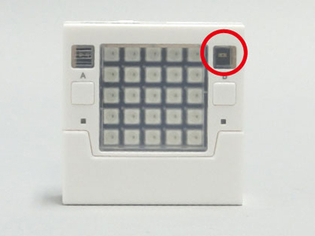

# 光センサーの制御
Studuino:bitの光センサーを使用します。<br>


光センサーの制御はStuduinoBitLightSensorクラスに定義され、StuduinoBitクラスでlightsensorにインスタンス化されています。</br>
はじめに、下記のようにStuduinoBitクラスをインスタンス化することで、Studuino:bitの光センサーを使用できます。
```Javascript
// Javascript Example
var stubit = new Artec.StuduinoBit("YOUR_STUDUINOBIT_ID");
```


## getValueWait();
光センサーの値を返します。0～4095の値を取ります。光センサーの値が大きいと、周囲が明るいことを示します。
```Javascript
// Javascript Example
while(1){
    let light = await stubit.lightsensor.getValueWait();
    console.log(light);    //光センサーの値をConsoleに表示します
    await stubit.wait(1000);
}
```
上のサンプルコードは光センサーの値を1秒ごとに表示します。
* 詳細<br>
https://artec-kk.github.io/obniz-artecrobo2/docs/classes/studuinobitlightsensor.html#getvaluewait

## 光センサーのサンプルプログラム
暗くなるとブザーが鳴るプログラムです。
```Javascript
// Javascript Example
<html>
<head>
  <meta charset="utf-8">
  <meta name="viewport" content="width=device-width, initial-scale=1">
  <script src="https://obniz.io/js/jquery-3.2.1.min.js"></script>
  <script src="https://unpkg.com/obniz@2.2.0/obniz.js"></script>
  <script src="https://artec-kk.github.io/obniz-artecrobo2/artec.js"></script>
</head>

<body>
<div id="obniz-debug"></div>
<h1>obniz instant HTML</h1>

  <script>
    var stubit = new Artec.StuduinoBit("YOUR_STUDUIOBIT_ID");
    stubit.onconnect = async function () {
      //wifi接続／動作確認用
    　stubit.led.on();
     
      while(1){
        let light = await stubit.lightsensor.getValueWait();　　//光センサーの値を返します
        if(light<300){
          await stubit.buzzer.onWait("G4");　　//ブザーからG4の音が鳴ります
        }else {
          stubit.buzzer.off();  //ブザーを止めます
        }
      } 
  }
</script>
</body>
</html>
```
