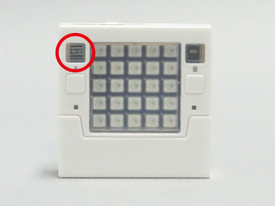

# 温度センサーの制御
Studuino:bitの温度センサーを使用します。<br>



温度センサーの制御はStuduinoBitTemperatureクラスに定義され、StuduinoBitクラスでtemperatureにインスタンス化されています。</br>
はじめに、下記のようにStuduinoBitクラスをインスタンス化することで、Studuino:bitの温度センサーを使用できます。
```Javascript
// Javascript Example
var stubit = new Artec.StuduinoBit("YOUR_STUDUINOBIT_ID");
```


## getValueWait();
温度センサーの値を返します。0～4095の値を取ります。<br>
取得した値から摂氏温度（℃）に変換したい場合は、Steinhart-Hart式を用います。Rに取得した温度センサーの値を入れてください。
$$
T=\frac{1}{\frac{1}{B}ln(\frac{R}{R_0})+\frac{1}{T_0+273.15}}-273.15
$$
$$
(B=3950\,\,,\,\,R_0=1000\,\,,\,\,T_0=25)
$$
また、華氏温度（℉）に変換したい場合は、上記の摂氏温度（℃）から以下の式を用いて変換します。
$$
F=T×1.8+32
$$
```Javascript
// Javascript Example
while(1){
    let temp = await stubit.temperature.getValueWait();
    console.log(temp);    //温度センサーの値をConsoleに表示します
    await stubit.wait(1000);
}
```
上のサンプルコードは温度センサーの値を1秒ごとに表示します。
* 詳細<br>
https://artec-kk.github.io/obniz-artecrobo2/docs/classes/studuinobittemperature.html#getvaluewait

## getCelsiusWait(Number:ndigits);
温度センサーの値を摂氏温度（℃）で返します。ndigits引数で小数点以下第何位まで表示するかを数字で指定します。既定値は小数第二位まで表示します。
```Javascript
// Javascript Example
while(1){
    let temp = await stubit.temperature.getCelsiusWait(3);
    console.log(temp);    //温度センサーの値をConsoleに表示します
    await stubit.wait(1000);
}
```
上のサンプルコードは温度センサーの値を小数第三位まで1秒ごとに表示します。
* 詳細<br>
https://artec-kk.github.io/obniz-artecrobo2/docs/classes/studuinobitlightsensor.html#getvaluewait

## 温度センサーのサンプルプログラム
現在の温度（℃）をディスプレイにスクロール表示するプログラムです。
```Javascript
// Javascript Example
<html>
<head>
  <meta charset="utf-8">
  <meta name="viewport" content="width=device-width, initial-scale=1">
  <script src="https://obniz.io/js/jquery-3.2.1.min.js"></script>
  <script src="https://unpkg.com/obniz@2.2.0/obniz.js"></script>
  <script src="https://artec-kk.github.io/obniz-artecrobo2/artec.js"></script>
</head>

<body>
<div id="obniz-debug"></div>
<h1>obniz instant HTML</h1>

  <script>
    var stubit = new Artec.StuduinoBit("YOUR_STUDUIOBIT_ID");
    stubit.onconnect = async function () {
    
      //wifi接続／動作確認用
    　stubit.led.on();
      
      while(1){
        let temp = await stubit.temperature.getCelsiusWait(1);　　//温度センサーの値を返します
        await stubit.display.scrollWait(temp);　　//ディスプレイにスクロール表示します
        await stubit.wait(1000);
      } 
  }

</script>
</body>
</html>
```
